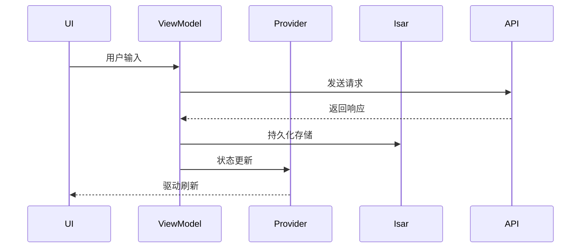

# Athena - 智能对话系统

[](https://flutter.dev)
[](https://dart.dev)

跨平台智能对话解决方案，集成大语言模型交互、实时信息检索和对话管理功能，采用现代化Flutter架构构建。

## 🚀 核心功能

- 多模型对话支持（OpenAI兼容API）
- 上下文感知的对话管理
- 实时网络搜索增强
- 本地对话记录存储（Isar数据库）
- 多平台支持（Windows/macOS/Linux/Web）

## 🛠 技术架构

### 分层架构设计
```
lib/
├── api/        # API通信层
├── model/      # 数据模型
├── provider/   # 状态管理层（Riverpod）
├── schema/     # 数据库Schema
├── util/       # 工具方法
├── view_model/ # 业务逻辑
└── widget/     # 界面组件
```

### 核心依赖
| 模块          | 功能               | 版本   |
|---------------|--------------------|--------|
| flutter_riverpod | 状态管理         | ^2.5.1 |
| auto_route    | 导航路由           | ^9.2.2 |
| isar          | 本地数据库         | ^3.1.8 |
| openai_dart   | LLM交互           | ^0.4.5 |
| system_tray   | 系统托盘           | ^2.0.2 |

## 🧩 模块交互流程

> Note right of Provider: Riverpod职责边界
> - 状态容器
> - UI状态同步
> - 监听ViewModel更新
> 
> Note left of ViewModel: 业务逻辑处理
> - API调用
> - 数据持久化
> - 状态预处理

## 🔧 开发指南

### 环境要求
- Flutter 3.22+
- Dart 3.4+
- Isar Inspector（调试数据库）

### 代码生成
```bash
flutter pub run build_runner build --delete-conflicting-outputs
```

### 调试命令
```bash
# 运行桌面端（调试模式）
flutter run -d macos

# 构建生产版本
flutter build macos
```

## 🤝 贡献指南
1. 所有状态变更通过Provider进行
2. 数据库操作必须通过Isar事务
3. API请求统一使用api/目录下的服务类

## 📄 许可证
MIT License © 2024 [Cals]
